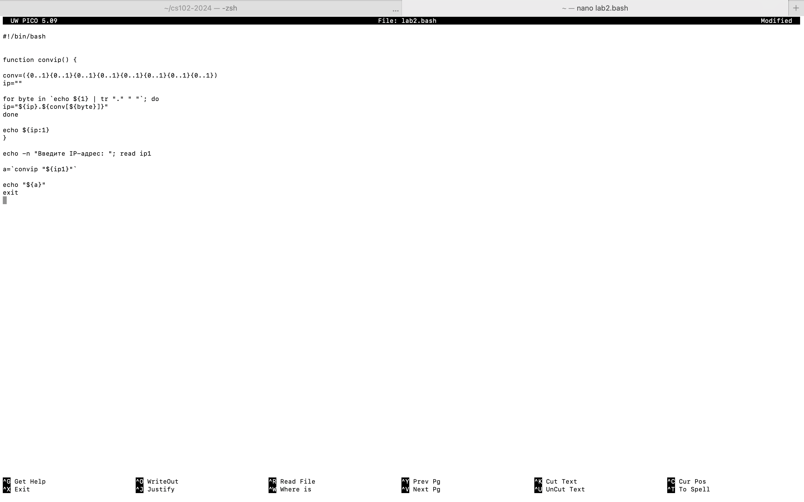
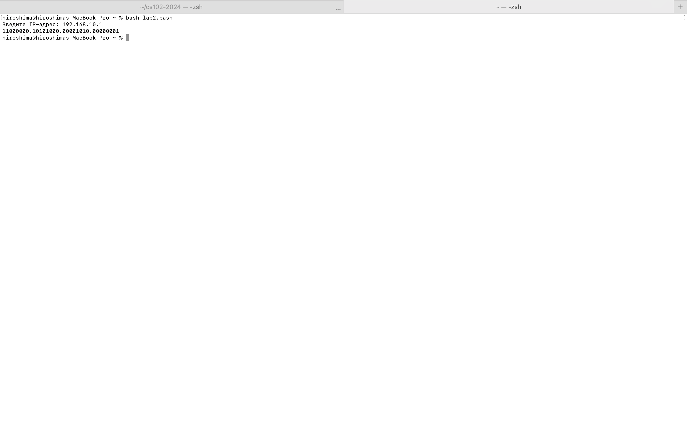

# Лабораторная работа №1 Пластинина Мария К3161
1) Я открыла созданный файл с расширением .bash и ввела функцию convip для преобразования десятичного IP в двоичный.

2) Далее я ввела массив, представляющий собой обозначение для генерации всех возможных комбинаций 8-битного двоичного числа.

3) Далее я инициализировала пустую строковую переменную для хранения результирующего двоичного IP-адреса.

4) При помощи команды for byte in я ввела цикл, который обрабатывает каждый байт и заменяет точки в введенном IP-адресе пробелами.

5) Внутри цикла двоичное представление каждого байта добавляется к 'ip' переменной с помощью массива conv.

6) При помощи команды echo вывожу конечный двоичный IP-адрес, опуская начальную точку.

7) Далее при помощи команды echo предлагаю пользователю ввести IP-адрес, а после ввода, при помощи команды read, введенный адрес сохраняется в переменной ip1.

8) Следующим шагом я ввела переменную, в которой будут сохранены результаты преобразования.

9) При помощи команды echo выводим двоичное представление IP-адреса.

